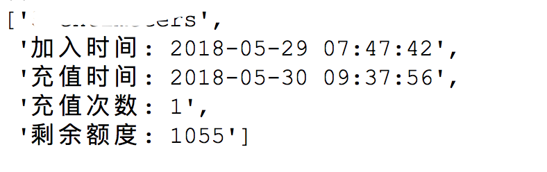
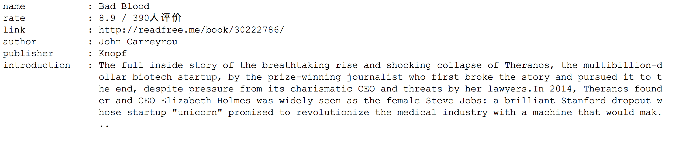

Python Web Scraping Notes

## Earning credits from [readfree.me](http://readfree.me)

 [readfree](http://readfree.me) is a book sharing website permitting users to push `.mobi/.epub/.pdf` formated books to Kindle or devices with Kindle installed. Every registered user can download books from it, as long as they have enough credits, which are vitual coins earned by either donating 10CNY(1.5$) to the website owner or by signing in each day. 

For those who wish to **download books without donating money** may found this repo useful. The very original intention is seeking a method to acquire more credits without opening my browser each day. This can be achieved smoothly with Python `requests`  + `urllib`, as shown in the codes ([readfree.py](./readfree/readfree.py)) . 

The idea is simple: 1. Log in my account -> 2. save cookies locally -> 3. load cookies and visit the webpage in background everyday. The login part is easy to implement, the captcha-recognizing thing, however, is most difficult and remains incompetent (`tesseract` is helpful but the recognizing result is unsatisfactory). Training  `tesseract` for better rate is a great idea, but beyong my original intention of keeping things simple and convenient. 

I also extend the script with two subroutines to search more information from the website, such as checking out the hot books or getting info (book name, author, publisher, rating and introduction) of a single book. 

### Functionalities

* login [readfree](http://readfree.me) daily
* parse hot books information
* parse single book information

### Usage

1. The account name and password are stored in a `.json`  file, e.g., /usr/local/info/account.json. This file will be loaded on creating a `Readfree` object: 

    ```python
    readfree = Readfree('/the/path/to/my_accout.json')
    ```

2. A local path must be specified to store cookies so we can keep logged in until the cookies turn invalid. Revise the path in`is_login()` in whatever way you see fit:

   ```python
   def is_login():
       cookie_path='/your/cookie/path/'
       ...
   ```

### Examples:

```python
rf = Readfree('/path/to/account.json')
print(rf.get_account_info()) # will print out basic infos on user

```

<p align="center"></p>

```python
a_book_link = "http://readfree.me/book/30222786/"
Aux().awesome_print(rf.parse_single_book(a_book_link))
# print info of book "Bad Blood" 
```

<p align="center"></p>


## Python [豆瓣](http://www.douban.com) Tool

By now (02/01/2019), the API service of [douban](http://www.douban.com) is still under maintainence and remain closed to personal usage. 

This repo provides **two** alternative ways to interact with douban:

1. `requests` + `urllib` to simulate account login and to post pure-text status 
2. `selenium` + headless `chromediver`  to post text and media

Both methods rely on cookies to avoid repeat login. The `webdriver` way is recommended since it supports images uploading while the first way (`requests`) only supports posting pure text status. 

### Examples

```python
# To post a status 
python3 douban.py 'sent from CentOS 7.0 terminal' # or,
python3 dbwebdriver.py 'sent from Ubuntu 18.10 termianl'

# To post status with (at most 9) images 
python3 dbwebdriver.py 'sent from Ubuntu 18.10 termianl' /images/1.jpg /images/2.jpg # or,
# The order of text and images does not matter
pythonn3 dbwebdriver.py 'How are you, guys? ' images/googmorning.jpg '\nI feel great today' images/selfie.png
```


### Notes

* On first run of `dbwebdriver.py`, you will have to login your account manually to cache cookies, which can be duplicated to other devices and utilized with no further login requirement.   
* The `chromedriver` version has to match the chrome version on your device, otherwise the program may crash. You can find on [chomedriver from chrome](http://chromedriver.chromium.org/downloads) for the right version.  More mirrors of chromedriver can be found [here](https://npm.taobao.org/). 


### Contact

[<p align="center"></p>](mailto:ssrzz@pm.me)


