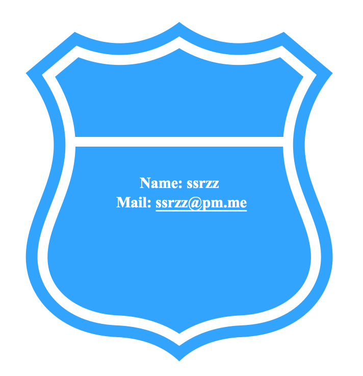

Python Web Scraping Notes

## Scraping http://readfree.me

<p align="center"></p>

 [readfree](http://readfree.me) is a book sharing website that allows users to push `.mobi/.epub/.pdf` formated books to Kindle. Every registered user can download books freely from this website, as long as they have enough credits, which can be earned by either donating 10CNY(1.5$) to the website owner or by signing in each day. 

I was attracted by webs-craping recently (2018-12), so the idea came to me that maybe I can write a script to automatically login the website each day to earn more credits, although I've donated 10 CNY to the owner in exchange of 1000 credits.

The login part is easy to implement with a few lines of Python3 code, even though the captcha-recognizing part is difficult and remains incompetent. I soon extend the script for parsing more information from the website, such as acquiring a list of books information (book name, author, publish, rates and abstract) from the hot page.  

### What it can do ?

* login [readfree](http://readfree.me) daily
* parse hot books information
* parse user account information

### How to use it ?
1. The account name and password are stored in a `.json`  file, e.g., /usr/local/info/account.json. This json file will be loaded creating each object: 

    ```pyth
   readfree = Readfree('/the/path/to/my/accout/json/')
    ```

2. A local path must be specified to store cookies so we can keep logged in until the cookies turn invalid. Change the path in `is_login()` method:

   ```python
   def is_login():
       cookie_path='/ur/cookie/path/'
       ...
   ```

### Examples:

```python
rf = Readfree('/path/to/account.json')
print(rf.get_account_info()) # will print out basic infos on user

```

<p align="center"></p>

```python
Aux().awesome_print(rf.parse_single_book("http://readfree.me/book/30222786/"))
# print info on book "Bad Blood" 
```

<p align="center"></p>


### Contact 

[<p align="center">[</p>](mailto:ssrzz@pm.me)


