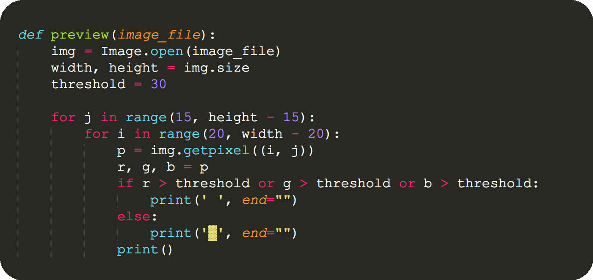

### 记一次有意思的captcha(半自动化)识别

[北邮人BT](https://bt.byr.cn) 是一个有趣的网站，无私的网站，一个造福万千IPv6用户的资源共享网站。

下载资源是完全免费的，但免费不意味着可以随心所欲。所有下载都会占用流量，而流量会被统计记录下来，下载过多+上传不足会严重降低分享率，分享率低到一定水平，账号就基本上GG了，与之关联的手机号将不能再次注册。所以，byrbt用户的一大“乐趣”就在于刷流量：频繁大量下载免费(免流量)资源来提高分享率。

 
但鲁迅先生曾说：如果不是因为特殊爱好，凡能交给机器自动化处理的事情，我们为什么一定要亲手做呢？于是，我考虑写一个脚本。

[`byr.py`](./byr.py) 是 一个Python3实现的刷流量脚本，其功能一言以敝之，

> 自动登录byrbt网站  -> 搜索首页的免费资源(一般为5条) -> 下载对应的torrent文件 -> 判断资源大小 -> 判断系统是否有足够的存储空间 -> 下载资源并做种 -> 24小时后循环此流程。 
>
> 特点：一次登录，长期运行，无须值守

### Implementation

* 登陆网站依赖`requests`/`pickle`/`bs4`库，第一登录需要识别验证码(capthca)，登录成功后会保存cookies，之后再登录可直接读取cookies免密码登录
* 免费资源分析`session.findAll(...)` 
*  torrent文件下载 `session.get(torrentlink, allow_redirects=True)` 
* 资源大小判断 `transmission-show` (under Linux / MacOS) 
* 系统空间 `df -h` (Linux基本命令)
* 下载软件 `transmission-cli`

​	困难的地方在于captcha识别，`tesseract`的识别效果并不理想，通过神经网络或SVM训练来实现全自动识别，对我这个新手而言有点复杂。考虑到captcha只会在第一次(或者很多天后的第一次)登录时才会遇到，如果有一个**快速打印 captcha 图片并保持一定的清晰度**的方法，对于 Linux/MacOS 终端使用者来说，额外的工作量也就是几秒钟的事情: 快速从屏幕上读取几个字符，然后输入给`input`。 

​	经过几次试验，发现byrbt的验证码比较规整，由6位字符(字母+数字)组成，且字符相对于背景噪点比较清楚，并垂直集中于图片中间，比下图

 
 

可以看到字符甚至是加粗的，这对于我们来说是一个好消息。一个非常直觉的想法即是提取图片相素，做少许处理，再打印到屏幕上，这一点可以借助`Image`库轻松实现。代码图如下 (图中黄色亮斑不是光标，是有意加粗的长方形字符块)：

  

在服务器终端上运行，打印结果还算比较清楚，效果如下：

  

Another example:

原图

 
 
 

打印效果图

  

具体代码可见 [byr.py](./byr.py). 

Notes :

* 运行机器需支持IPv6

* `session.post(url, data=params)`时 url = "https://bt.byr.cn/takelogin.php"，而非"https://bt.byr.cn/login.php"， 在网页源码中可以看到 action = "takelogin.php"。 url 写错将无法登录。

  

* 脚本运行在VPS上，由于存储空间不足20G，脚本每24小时会删除已经下载的文件 [默认存储在~/Downloads/]。